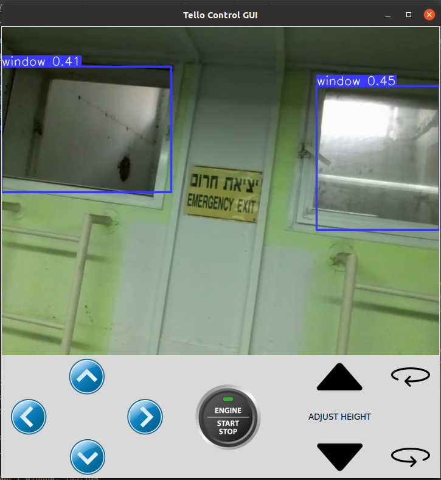

#  Window Detecting and Entering Project

This project aims to detect and enter windows in a building facade using computer vision techniques. The project consists of several files and directories, each serving a specific purpose. Below is an overview of the files included in this project:

## Files

1. **buttons/**: This directory contains images of buttons used in the graphical user interface (GUI) of the application. These buttons are used for various interactions with the window detection and entering system.

2. **corner.py**: This file contains an implementation of the algorithm for turning when reaching the end of the building. This feature is considered as future work and is not currently utilized in the main application.

3. **facade.jpg**: An example image of a building facade that can be used to test the model's performance. This image can be used as input to the window detection algorithm to detect and enter windows.

4. **main.py**: The main file of the project. It serves as the entry point for the application and contains the code for the graphical user interface (GUI) and the integration of the window detection and entering functionalities.

5. **rectangle_detection.py**: This file contains the implementation of the rectangle detection algorithm. It provides functions to detect rectangular shapes within an image and returns their coordinates.

6. **requirements.txt**: This file lists all the dependencies and packages required to run the project. It is recommended to install these dependencies before running the application.

7. **window_detector.pt**: This file contains a pre-trained model for window detection. The model is trained using computer vision techniques and can be loaded to perform window detection on input images.

## Graphical User Interface (GUI)

The application includes a graphical user interface (GUI) that provides an interactive way to control the window detection and entering process. The GUI offers the following features:

- Color Picker: The GUI includes a color picker tool that allows the user to specify the color of the building in the image, simple click on a pixel in the captured frame to set the building color. This feature is considered as future work and is not currently utilized in the main application.

- Navigation Buttons: The GUI provides directional buttons for navigation, including forward, backward, right, left, up, and down. These buttons enable the user to move the drone or camera perspective within the simulated environment.

- Rotation Buttons: The GUI includes rotate clockwise and rotate counterclockwise buttons. These buttons allow the user to rotate the drone or camera perspective in the simulated environment.

- Start Button: The GUI features a start button that initiates the window detection process. Once clicked, the algorithm will start analyzing the image and detecting windows.



- Popup Message: When a window is detected, a popup message will appear, allowing the user to choose whether to turn off the window detection model and navigate to the detected window or continue scanning for more windows.

## Usage

To use this project, you can follow these steps:

1. Install the required dependencies listed in the **requirements.txt** file. You can use the following command to install the dependencies:

   ```
   pip install -r requirements.txt
   ```

2. Once the dependencies are installed, you can run the application by executing the **main.py** file. This will start the graphical user interface (GUI) where you can interact with the window detection and entering system.

3. Use the provided **facade.jpg** image or select your own image as input to test the window detection algorithm. The application will process the image and display the detected windows.

4. Adjust the color picker to match the color of the building in the image. This step helps improve the accuracy of window detection.

5. Interact with the GUI using the provided navigation buttons and rotation buttons to explore the simulated environment and capture images for window detection.

6. Click the start button to initiate the window detection process. The algorithm will analyze the current image
